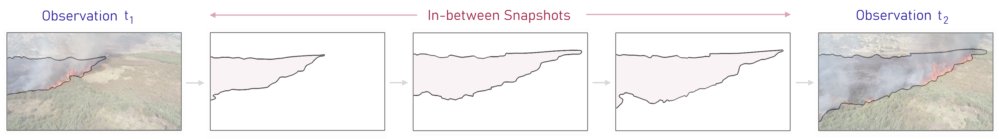
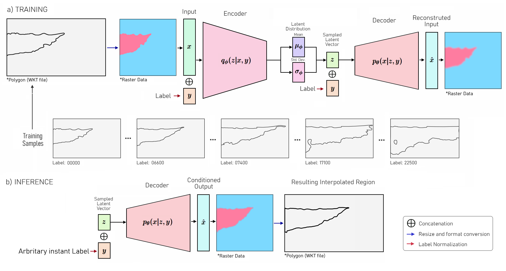

# Reconstructing Spatiotemporal Data with C-VAEs
---

<p align="center">

</p>

---

### Abstract 

The continuous representation of spatiotemporal data commonly relies on using abstract data types, such as \textit{moving regions}, to represent entities whose shape and position continuously change over time. Creating this representation from discrete snapshots of real-world entities requires using interpolation methods to compute in-between data representations and estimate the position and shape of the object of interest at arbitrary temporal points. Existing region interpolation methods often fail to generate smooth and realistic representations of a region's evolution. However, recent advancements in deep learning techniques have revealed the potential of deep models trained on discrete observations to capture spatiotemporal dependencies through implicit feature learning.

In this work, we explore the capabilities of Conditional Variational Autoencoder (C-VAE) models to generate smooth and realistic representations of the spatiotemporal evolution of moving regions. We evaluate our proposed approach on a sparsely annotated dataset on the burnt area of a forest fire. We apply compression operations to sample from the dataset and use the C-VAE model and other commonly used interpolation algorithms to generate in-between region representations. To evaluate the performance of the methods, we compare their interpolation results with manually annotated data and regions generated by a U-Net model. We also assess the quality of generated data considering temporal consistency metrics.

The proposed C-VAE-based approach demonstrates competitive results in geometric similarity metrics. It also exhibits superior temporal consistency, suggesting that C-VAE models may be a viable alternative to modelling the spatiotemporal evolution of 2D moving regions.

#### Burned Area 2D Moving Region 

<div align="center">

<p>Continuous representation model requires a method to recreate the spatiotemporal evolution of a region, such as the progression of the burned area.</p>
</div>

#### C-VAE 

<div align="center">

<p><strong>Employed C-VAE Architecture.</strong>  a) each region stored in WKT
format is converted to raster image to be processed by the model b) a new image
is generated conditioned by a label and converted to WKT format.</p>
</div>

### Dataset Citation
```
@misc{Ribeiro2023_dataset,
  author       = {Ribeiro, Tiago F. R. and Silva, Fernando and Moreira, José and Costa, Rogério Luís de C.},
  title        = {BurnedAreaUAV Dataset (v1.1)},
  month        = may,
  year         = 2023,
  publisher    = {Zenodo},
  version      = {1.1},
  doi          = {10.5281/zenodo.7944963},
}
```
### To Do List:
- Complete code upload
- Complete ReadMe file with description and results summary
- ...
